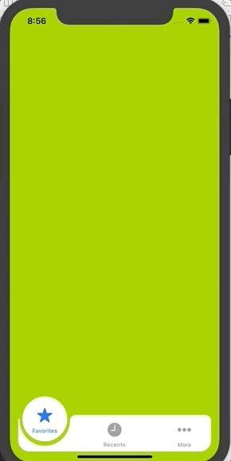
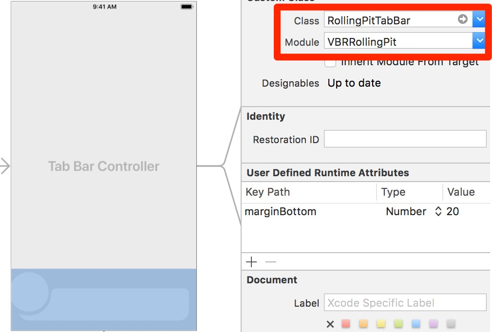
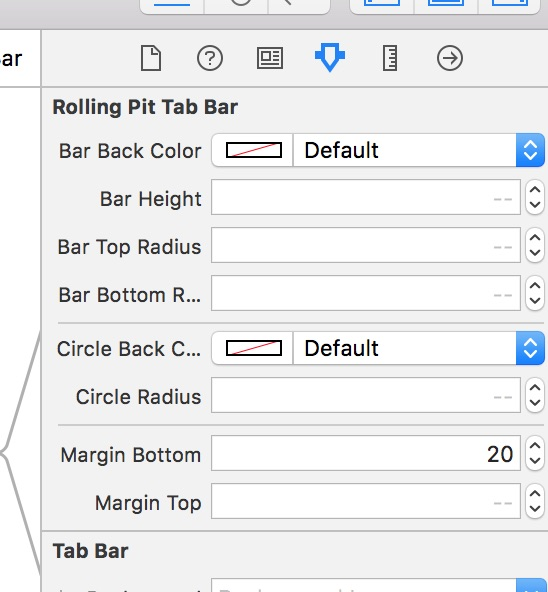

# VBRRollingPit
> Simple, beatiful and interactive UITabBar

By [v-braun - viktor-braun.de](https://viktor-braun.de).

[](https://cocoapods.org/pods/VBRRollingPit)

## Preview


## Description
Beautiful UITabBarView inspired by [this](https://dribbble.com/shots/4844696-Tab-bar-interaction-with-animated-icons) dribble from [Ketan Rajput](https://twitter.com/Ketan_MI)


## Installation

### CocoaPods
VBRRollingPit is available on [CocoaPods](http://cocoapods.org). Just add the following to your project Podfile:

```ruby
pod 'VBRRollingPit'
```

Or from GitHub:

```ruby
pod 'VBRRollingPit', :git => 'https://github.com/v-braun/VBRRollingPit.git'
```

### Manually
1. Download and drop ```VBRRollingPit.swift``` in your project.  
2. Congratulations!  

## Usage

1. Drop a TabBarController into your app
2. Select the UITabBar 
3. Set the "Class" property to VBRRollingPit



See the *Example* Project.


## Configuration
Additional properties are available in the Attribute inspector:




### Known Issues

If you discover any bugs, feel free to create an issue on GitHub fork and
send me a pull request.

[Issues List](https://github.com/v-braun/VBRRollingPit/issues).

## Authors

  
[v-braun](https://github.com/v-braun/)


## Contributing

1. Fork it
2. Create your feature branch (`git checkout -b my-new-feature`)
3. Commit your changes (`git commit -am 'Add some feature'`)
4. Push to the branch (`git push origin my-new-feature`)
5. Create new Pull Request


## License

See [LICENSE](https://github.com/v-braun/VBRRollingPit/blob/master/LICENSE).

